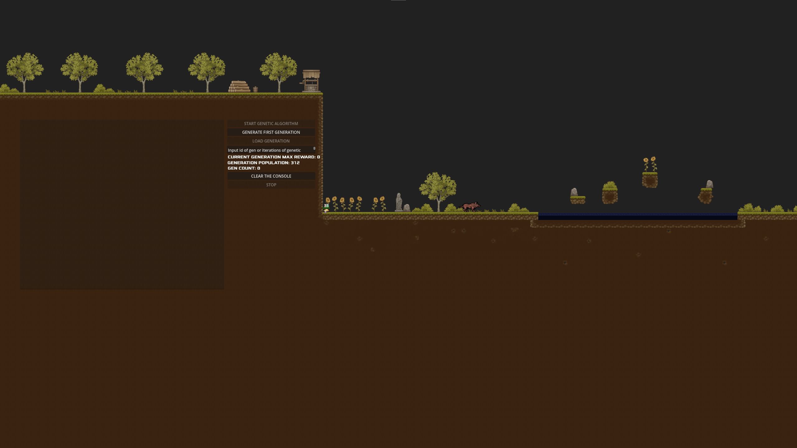

# Implementacja algorytmu uczenia maszynowego w sterowaniu agentem w grze platformowej

Projekt ten jest implementacją gry platformowej 2D, w której agent (chomik) uczy się przechodzić kolejne poziomy przy wykorzystaniu połączenia algorytmu genetycznego z uczeniem maszynowym ze wzmocnieniem (**Reinforcement Learning**, **RL**). Kod został przygotowany w ramach pracy licencjackiej.

## Sposób uruchomienia
1. Upewnij się, że posiadasz zainstalowany silnik **Godot Engine** w wersji **4.2.1-stable** (lub nowszy z gałęzi 4.x).
2. Otwórz **Godot Engine** i wybierz opcję **Import**.
3. Wskaż plik `project.godot` znajdujący się w głównym folderze repozytorium.
4. Kliknij **Import & Edit**.
5. W prawym górnym rogu edytora naciśnij przycisk **Play** (lub wciśnij `F5`), aby uruchomić główne menu.
6. Z poziomu interfejsu (**GUI**) wybierz przycisk **START**, a następnie jeden z poziomów (**LEVEL_0** do **LEVEL_3**).

## Spis technologii
- **Silnik gry:** **Godot Engine** 4.2.1-stable
- **Język programowania:** **GDScript**
- **Grafika:** **GIMP** 2.10.36 (tworzenie autorskich modeli, np. agenta), darmowe zasoby **Tileset** (**Cainos**) oraz modele przeciwników.
- **Styl wizualny:** **Pixelart** (rzut z boku / side-scrolling)

## Konstrukcja aplikacji
Aplikacja została zaprojektowana w oparciu o architekturę silnika **Godot**, wykorzystując drzewo węzłów i sceny:
- **Kluczowe elementy środowiska:** 4 różne poziomy (od 0 do 3) o rosnącym stopniu trudności, zawierające zróżnicowane przeszkody (lawa, czarna materia, kolce, emiter lawy) oraz przeciwników (wilk).
- **Agent:** Postać potrafiąca wykonywać skoki oraz ruch w prawo, posiadająca zaimplementowany mechanizm kolizji (hitboxy) oraz system zdrowia (0-100%).
- **Menedżer algorytmu:** Kontroler w postaci skryptu `algorithm.gd`, zarządzający generacjami, populacją oraz przydzielaniem agentów do odpowiednich wątków procesora.
- **Konsola UI:** Interfejs (**GUI**) pozwalający na definiowanie liczby iteracji, generowanie początkowej populacji, ładowanie konkretnych generacji z plików txt oraz ręczne zatrzymywanie procesu.

## Stochastyczne przeszukiwanie z nawrotami (z elementami Algorytmu Genetycznego i **RL**)
W rzeczywistości zastosowane podejście to w głównej mierze **stochastyczne przeszukiwanie z nawrotami**, które wykorzystuje elementy algorytmu genetycznego w połączeniu z uczeniem maszynowym ze wzmocnieniem (**RL**).
1. **Stochastyczne przeszukiwanie z nawrotami:** Ze względu na odrzucenie klasycznego krzyżowania i mutacji, algorytm nie ewoluuje w sposób typowy dla algorytmów genetycznych. Osiąga sukces poprzez odtwarzanie znanej, dobrej sekwencji ruchów, po czym "cofa się" o kilka kroków (usuwanie 1-3 ostatnich akcji poprzez `pop_back()`) i wykonuje nowe, losowe przeszukiwanie (stochastyczność). Dzięki temu agent w przypadku napotkania ślepego zaułka lub śmierci potrafi się wycofać i sprawdzić inną, losową ścieżkę.
2. **Uczenie ze wzmocnieniem (**RL**):** Występuje w momencie oceny ścieżki po wykonaniu akcji (`move()`). Każda akcja niesie za sobą konsekwencje – za poprawne działania (jak poruszanie się do przodu i skakanie) agent otrzymuje **nagrodę** (punkty), a w przypadku śmierci, wpadnięcia na przeszkodę lub zablokowania się (stania w miejscu), otrzymuje **karę** (ujemne punkty). Cały ten proces opiera się na metodzie prób i błędów, kierując procesem przeszukiwania.
3. **Elementy Algorytmu Genetycznego:** Mimo że mechanika to głównie przeszukiwanie z nawrotami, implementacja zapożycza struktury z algorytmów genetycznych do optymalizacji:
   - **Zarządzanie populacją:** Równoległe przeszukiwanie drzewa rozwiązań przez wieloosobniczą populację agentów.
   - **Selekcja (Fitness):** W każdym cyklu agenci są sortowani malejąco według zdobytej nagrody, a przeszukiwanie w kolejnej iteracji bazuje na najlepszych znalezionych dotąd ścieżkach z poprzedniej generacji.

**Dlaczego jest to efektywne dla takich poziomów?**
Środowisko gier platformowych 2D (szczególnie statyczne) opiera się na ścisłym determinizmie fizyki. Dzięki systemowi kar i nagród algorytm szybko odrzuca błędne gałęzie przeszukiwania. Iteracyjne cofanie się (nawrót) i stochastyczne poszukiwanie nowej drogi (odcięcie błędnej końcówki i losowanie nowych akcji) pozwala na skuteczne przetestowanie ("wyuczenie się na pamięć") idealnej trasy od punktu A do punktu B bez obaw o trwałe utknięcie agenta.

## Ograniczenia algorytmu
Mimo że zaimplementowany algorytm poprawnie realizuje zadanie przejścia poziomów, ma pewne ograniczenia opisane w pracy:
1. **Brak uniwersalności i percepcji (Brak Sieci Neuronowej):** Agent polega tylko i wyłącznie na odtwarzaniu wyuczonego ciągu akcji. Nie analizuje w czasie rzeczywistym tego, co widzi. Oznacza to, że jest niezdolny do działania w środowisku w pełni dynamicznym i nie "zareaguje", jeżeli na jego drodze pojawi się niespodziewana przeszkoda lub losowo poruszający się przeciwnik.
2. **Synchronizacja czasu (time.sleep / delay):** Algorytm do działania akcji wymaga odpowiedniego odczekania (`await get_tree().create_timer()` dla agenta lub `OS.delay_msec()` dla wątków zarządzających). W silnikach gier może to rodzić problemy z optymalną współbieżnością i płynnością trenowania.
3. **Specyfika poziomów:** Rozwiązanie nie poradzi sobie z każdym możliwym poziomem gry platformowej 2D. Wymaga dostosowywania parametrów (liczebności populacji, odpowiedniego balansu funkcji nagrody) pod konkretne układy terenu. Znacząca ilość rozległych przepaści bardzo wydłuża czas uczenia.

## Możliwości rozwoju
Aplikacja została zaprojektowana w sposób, który umożliwia jej dalszą rozbudowę i wprowadzanie lepszych systemów sztucznej inteligencji:
- **Zastosowanie Sieci Neuronowej:** Głównym kierunkiem rozwoju byłoby dodanie sieci, która analizowałaby obraz z gry i samodzielnie przewidywała możliwe ruchy dla danego stanu środowiska na żywo, a nie tylko z góry zdefiniowanej tablicy.
- **NEAT / Deep-Q-Networks (**DQN**):** Zastąpienie hybrydowego genetycznego podejścia pełnoprawnym algorytmem **DQN** lub ewolucją topologii i wag (**NEAT**).
- **Optymalizacja współbieżności:** Poprawa sposobu zarządzania agentami przez poszczególne wątki przy użyciu nowoczesnych narzędzi silnika **Godot**, minimalizując wpływ oczekiwań czasowych na pętlę procesu fizyki.

